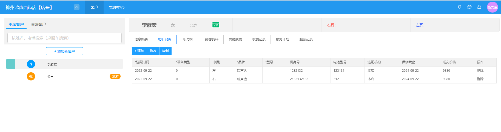
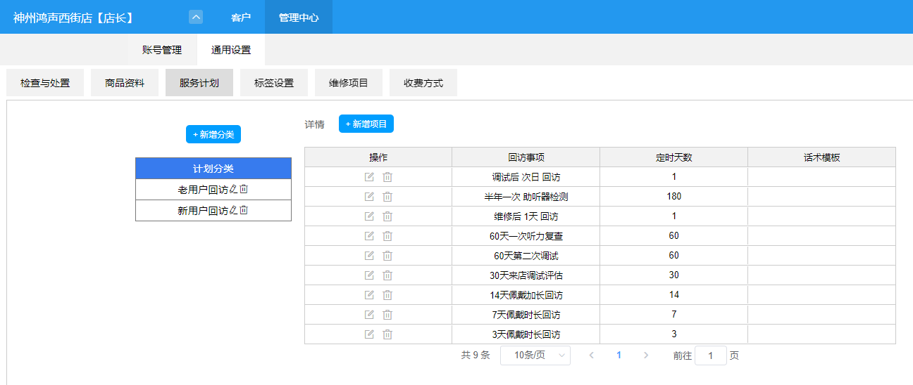

# 听友管理系统

#### 一、介绍

这是一个听力管理系统
1、可以设置多店
2、每个店可以有N个管理员
3、可以设置每一个客户的客户信息，如客户的基本信息，通讯录，病历信息、客户标签
4、可以设置每一个客户的助听设备，听力图、影像资料、营销线索、收费记录、服务计划和服务记录

#### 二、技术选型

1. HTML + CSS + JavaScript
2. PHP
3. MySQL
4. Redis
5. Nginx

#### 三、实现功能

1. 客户
- 客户类型
  - 本店客户
  - 漫游客户
- 信息概要
  - 基本信息
  - 通讯录
  - 病例信息
  - 客户标签
- 助听设备
- 听力图
  - 左耳
  - 右耳
- 影像资料
- 营销线索
- 收费记录
- 服务计划
- 服务记录

2. 管理中心
- 账号管理
  - 门店管理
  - 角色管理
  - 账号管理
  - 登录日志
  - 栏目管理
- 通用设置
  - 检查与处置
  - 商品资料
  - 服务计划
  - 标签设置
  - 维修项目
  - 收费方式

#### 四、系统平台功能导图

#### 客户管理平台系统界面展示

#### 管理中心通用设置界面展示

#### 联系方式

需要的联系，低价出售，私信联系我！！
